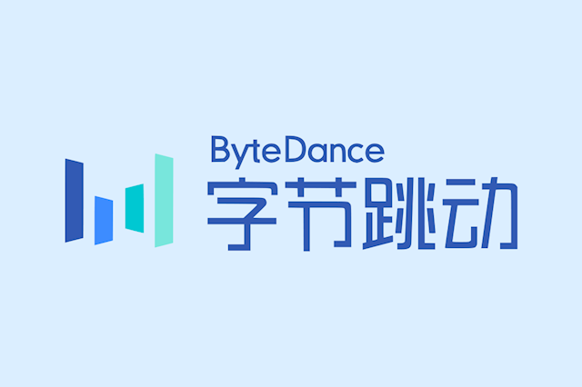
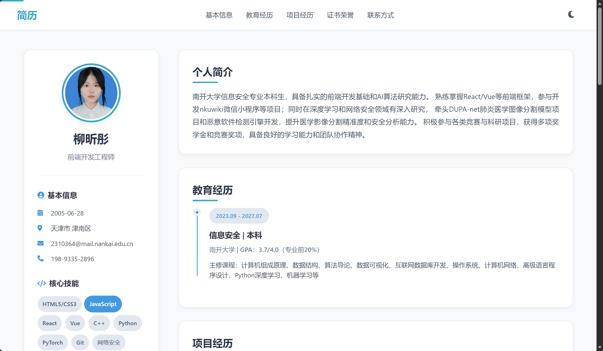

# 个人简历网页项目

## 项目简介


字节跳动训练营第一次课程作业，实现一个现代化响应式的个人简历网页，使用HTML、CSS 和 JavaScript 开发。

## 功能介绍

### 1. 响应式设计

- ✅ 桌面端（≥1200px）：左右分栏布局，侧边栏固定宽度
- ✅ 平板端（768px-1199px）：优化的左右分栏布局
- ✅ 移动端（≤767px）：上下堆叠单栏布局

### 2. 核心功能

核心功能包括语义化HTML（使用`<nav>`、`<aside>`、`<section>`、`<footer>`等标签）、Flex/Grid布局（主容器Grid，内部Flex）、项目展开/折叠（点击标题切换详情）、技能筛选（标签过滤项目）、暗黑模式切换（自动保存偏好）、滚动进度指示器（顶部显示进度）、平滑滚动（导航链接跳转）和打印优化（自动展开项目）。

### 3. 视觉设计和交互体验

- 🎨 我喜欢商务风配色，外加一些渐变色背景和按钮，使用时间轴可视化展示教育经历，此外还有进度条动画和卡片悬停效果。



### 4.网页展示

<video controls>
  <source src="video.mp4" type="video/mp4">
  您的浏览器不支持 video 标签。
</video>

### 5. 性能优化部分

- 🚀 我使用防抖和节流函数优化滚动性能、Intersection Observer API 懒加载动画；使用本地存储保存主题偏好和滚动位置，并处理了打印前后状态。

## 文件结构

```
字节作业/
├── index.html      # HTML主文件
├── style.css       # CSS样式文件
├── script.js       # JavaScript交互文件
├── image.png       # 网页展示图
├── avatar.png      # 头像
├── image.png       # 网页展示图
├── video.mp4       # 展示视频
└── README.md       # 项目说明文档

```

## 使用说明

### 浏览器访问

直接在浏览器中打开 `index.html` 文件即可查看。

### 键盘快捷键

- `Ctrl/Cmd + P`：打印简历
- `Ctrl/Cmd + D`：切换暗黑模式
- `ESC`：关闭移动端菜单
- 按三次 `Shift`：启用调试模式

## 技术栈

- HTML5（语义化标签）
- CSS3（Flex/Grid、动画、渐变、媒体查询）
- JavaScript ES6+（DOM操作、事件监听、本地存储）
- Font Awesome 6.4.0（图标库）

## 浏览器兼容性

- ✅ Chrome/Edge（推荐）
- ✅ Firefox
- ✅ Safari
- ✅ Opera
- ⚠️ IE11及以下不支持

## 性能

### Core Web Vitals

- **Largest Contentful Paint (LCP)**: 0.11 秒 ✅ 良好
  - LCP 元素: `img.avatar`
- **Cumulative Layout Shift (CLS)**: 0 ✅ 良好
- **Interaction to Next Paint (INP)**: 32 ms ✅ 良好
- 🚀 防抖和节流函数会优化滚动性能,Intersection Observer API 懒加载动画。

## 你也可以自定义自己的简历

### 修改信息

在 `index.html` 中修改以下内容：
- 姓名、职位
- 联系方式
- 教育经历
- 项目经历
- 技能标签
- 证书荣誉

### 修改配色
在 `style.css` 的 `:root` 中修改 CSS 变量：

```css
:root {
  --primary-color: #2D3748;
  --secondary-color: #4299E1;
  --accent-color: #38B2AC;
  /* ... */
}
```
### 更换头像

替换 `avatar.img` 文件，或修改 `index.html` 中的图片路径


## 更新日期

2025.11.19
